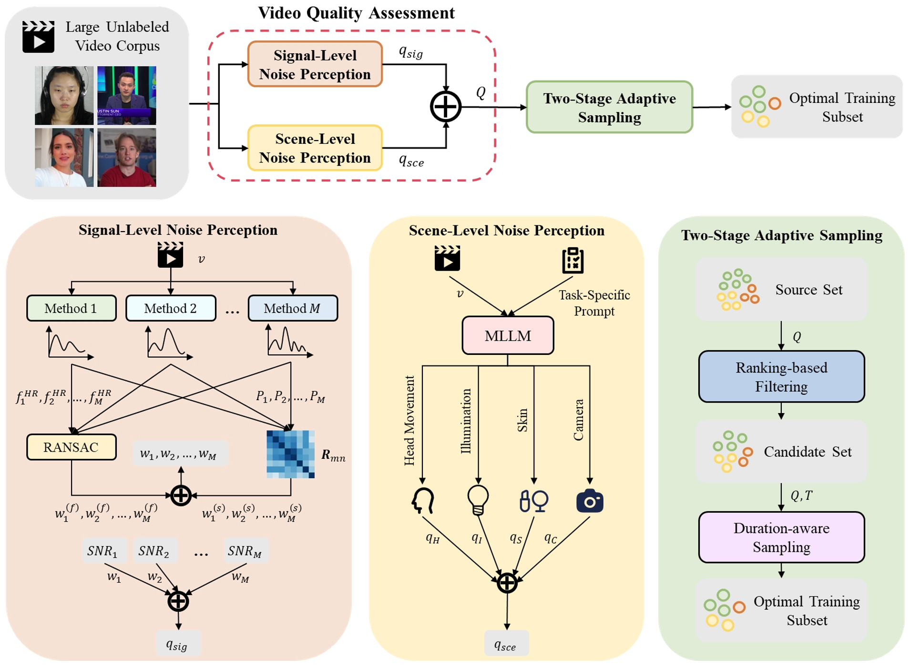

# *rPPG-VQA*: A Video Quality Assessment Framework for Unsupervised rPPG Training

Authors: [*Tianyang Dai*](https://openreview.net/profile?id=~Tianyang_Dai1), [*Ming Chang*](https://openreview.net/profile?id=~Ming_Chang2), [*Yan Chen*](https://openreview.net/profile?id=~Yan_Chen15), [*Yang Hu*](https://openreview.net/profile?id=~Yang_Hu3).

> Unsupervised remote photoplethysmography (rPPG) promises to leverage unlabeled video data, but its potential is hindered by a critical challenge: training on low-quality "in-the-wild" videos severely degrades model performance. An essential step missing here is to assess the suitability of the videos for rPPG model learning before using them for the task. Existing video quality assessment (VQA) methods are mainly designed for human perception and not directly applicable to the above purpose. In this work, we propose rPPG-VQA, a novel framework for assessing video suitability for rPPG. We integrate signal-level and scene-level analyses and design a dual-branch assessment architecture. The signal-level branch evaluates the physiological signal quality of the videos via robust signal-to-noise ratio (SNR) estimation with a multi-method consensus mechanism, and the scene-level branch uses a multimodal large language model (MLLM) to identify interferences like motion and unstable lighting. Furthermore, we propose a two-stage adaptive sampling (TAS) strategy that utilizes the quality score to curate optimal training datasets. Experiments show that by training on large-scale, "in-the-wild" videos filtered by our framework, we can develop unsupervised rPPG models that achieve a substantial improvement in accuracy on standard benchmarks.

For more details, please refer to our publication: [rPPG-VQA: A Video Quality Assessment Framework for Unsupervised rPPG Training](http://arxiv.org/abs/2604.11156).

## Acknowledgements

This work was supported by the National Natural Science Foundation of China under Grant 62172381.
